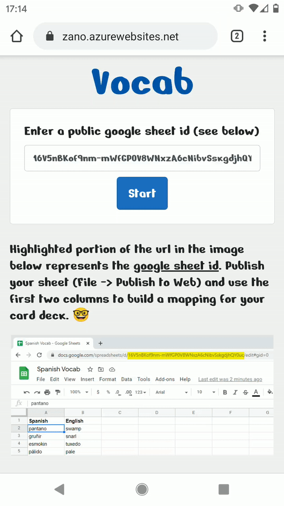
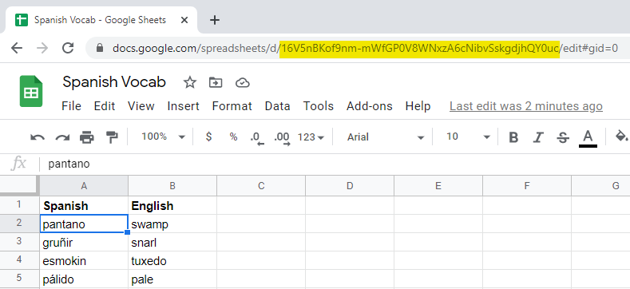
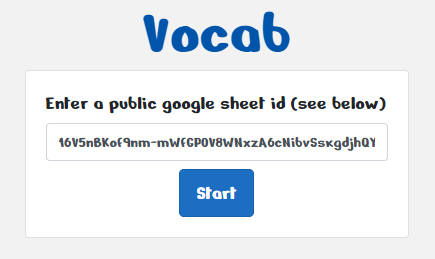

# Vocab

A .NET 5 Blazor WebAssembly project that allows you to create a set of multiple choice flashcards based off of a configured google sheet.

# Demo

[zano.azurewebsites.net](https://zano.azurewebsites.net)

## Instructions

1. Go to your google sheet and copy the equivalent highlighted portion of the url. This is your **google sheet id**. Use the first two columns to build a mapping for your card deck. 🤓

   

2. Publish your google sheet through (File --> Publish to Web)

3. Enter the **google sheet id** into the initial input of the Vocab site and hit the start button.

    

### Feedback is appreciated
